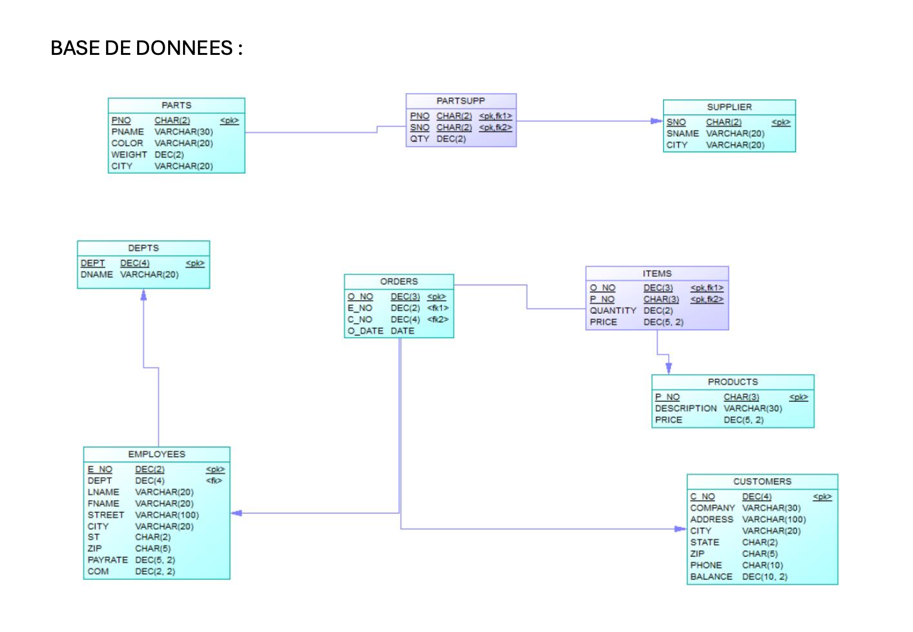

---

## 📦 BASE DE DONNÉES

### 🧩 Table : `PARTS`

| Champ    | Type        | Clé   |
| -------- | ----------- | ----- |
| `PNO`    | CHAR(2)     | 🔑 PK |
| `PNAME`  | VARCHAR(30) |       |
| `COLOR`  | VARCHAR(20) |       |
| `WEIGHT` | DEC(2)      |       |
| `CITY`   | VARCHAR(20) |       |

---

### 🧩 Table : `SUPPLIER`

| Champ   | Type        | Clé   |
| ------- | ----------- | ----- |
| `SNO`   | CHAR(2)     | 🔑 PK |
| `SNAME` | VARCHAR(20) |       |
| `CITY`  | VARCHAR(20) |       |

---

### 🔗 Table : `PARTSUPP`

| Champ | Type    | Clé                         |
| ----- | ------- | --------------------------- |
| `PNO` | CHAR(2) | 🔑 PK, 🔗 FK → PARTS.PNO    |
| `SNO` | CHAR(2) | 🔑 PK, 🔗 FK → SUPPLIER.SNO |
| `QTY` | DEC(2)  |                             |

---

### 🧩 Table : `PRODUCTS`

| Champ         | Type        | Clé   |
| ------------- | ----------- | ----- |
| `P_NO`        | CHAR(3)     | 🔑 PK |
| `DESCRIPTION` | VARCHAR(30) |       |
| `PRICE`       | DEC(5, 2)   |       |

---

### 🔗 Table : `ITEMS`

| Champ      | Type      | Clé                           |
| ---------- | --------- | ----------------------------- |
| `O_NO`     | DEC(3)    | 🔑 PK, 🔗 FK → ORDERS.O\_NO   |
| `P_NO`     | CHAR(3)   | 🔑 PK, 🔗 FK → PRODUCTS.P\_NO |
| `QUANTITY` | DEC(2)    |                               |
| `PRICE`    | DEC(5, 2) |                               |

---

### 🧾 Table : `ORDERS`

| Champ    | Type   | Clé                     |
| -------- | ------ | ----------------------- |
| `O_NO`   | DEC(3) | 🔑 PK                   |
| `E_NO`   | DEC(4) | 🔗 FK → EMPLOYEES.E\_NO |
| `C_NO`   | DEC(4) | 🔗 FK → CUSTOMERS.C\_NO |
| `O_DATE` | DATE   |                         |

---

### 🧩 Table : `EMPLOYEES`

| Champ     | Type         | Clé                |
| --------- | ------------ | ------------------ |
| `E_NO`    | DEC(2)       | 🔑 PK              |
| `DEPT`    | DEC(4)       | 🔗 FK → DEPTS.DEPT |
| `LNAME`   | VARCHAR(20)  |                    |
| `FNAME`   | VARCHAR(20)  |                    |
| `STREET`  | VARCHAR(100) |                    |
| `CITY`    | VARCHAR(20)  |                    |
| `ST`      | CHAR(2)      |                    |
| `ZIP`     | CHAR(5)      |                    |
| `PAYRATE` | DEC(5, 2)    |                    |
| `COM`     | DEC(2, 2)    |                    |

---

### 🏢 Table : `DEPTS`

| Champ   | Type        | Clé   |
| ------- | ----------- | ----- |
| `DEPT`  | DEC(4)      | 🔑 PK |
| `DNAME` | VARCHAR(20) |       |

---

### 👥 Table : `CUSTOMERS`

| Champ     | Type         | Clé   |
| --------- | ------------ | ----- |
| `C_NO`    | DEC(4)       | 🔑 PK |
| `COMPANY` | VARCHAR(30)  |       |
| `ADDRESS` | VARCHAR(100) |       |
| `CITY`    | VARCHAR(20)  |       |
| `STATE`   | CHAR(2)      |       |
| `ZIP`     | CHAR(5)      |       |
| `PHONE`   | CHAR(10)     |       |
| `BALANCE` | DEC(10, 2)   |       |

---

🔗 = Clé étrangère (foreign key)
🔑 = Clé primaire (primary key)

Souhaites-tu aussi une version SQL de création des tables (`CREATE TABLE` statements) ?
