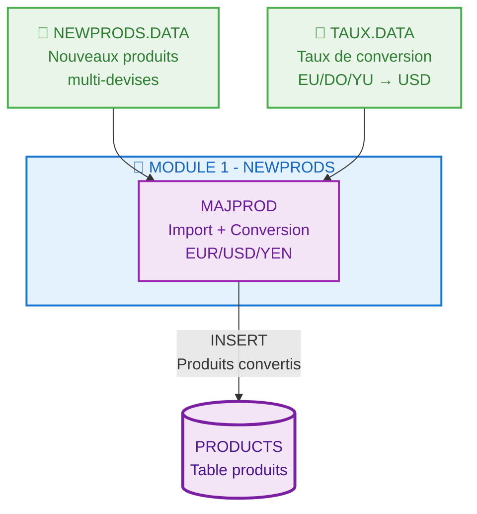

```mermaid
graph TB
    %% Définition des styles
    classDef moduleStyle fill:#e3f2fd,stroke:#1976d2,stroke-width:2px,color:#1565c0
    classDef dbStyle fill:#f3e5f5,stroke:#7b1fa2,stroke-width:3px,color:#4a148c
    classDef fileStyle fill:#e8f5e8,stroke:#4caf50,stroke-width:2px,color:#2e7d32
    classDef programStyle fill:#f3e5f5,stroke:#9c27b0,stroke-width:2px,color:#6a1b9a

    %% Fichiers d'entrée
    NEWPRODS_CSV[📄 NEWPRODS.DATA<br/>Nouveaux produits<br/>multi-devises]:::fileStyle
    TAUX_CSV[📄 TAUX.DATA<br/>Taux de conversion<br/>EU/DO/YU → USD]:::fileStyle

    %% Module 1
    subgraph M1 ["🔧 MODULE 1 - NEWPRODS"]
        MAJPROD[MAJPROD<br/>Import + Conversion<br/>EUR/USD/YEN]:::programStyle
    end
    M1:::moduleStyle

    %% Base de données
    PRODUCTS[(PRODUCTS<br/>Table produits)]:::dbStyle

    %% Flux
    NEWPRODS_CSV --> MAJPROD
    TAUX_CSV --> MAJPROD
    MAJPROD -->|INSERT<br/>Produits convertis| PRODUCTS
```