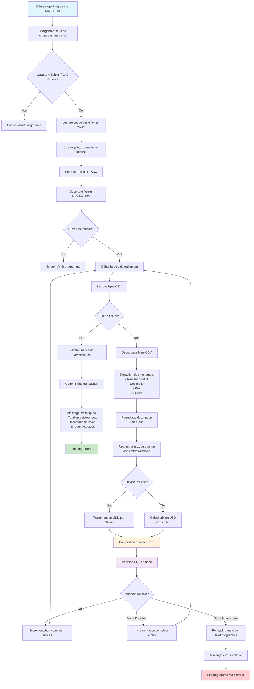

```mermaid
flowchart TD
    A[Démarrage Programme MAJPROD] --> B[Chargement taux de change en mémoire]
    B --> C{Ouverture fichier TAUX réussie?}
    C -->|Non| D[Erreur - Arrêt programme]
    C -->|Oui| E[Lecture séquentielle fichier TAUX]
    E --> F[Stockage taux dans table interne]
    F --> G[Fermeture fichier TAUX]
    
    G --> H[Ouverture fichier NEWPRODS]
    H --> I{Ouverture réussie?}
    I -->|Non| J[Erreur - Arrêt programme]
    I -->|Oui| K[Début boucle de traitement]
    
    K --> L[Lecture ligne CSV]
    L --> M{Fin de fichier?}
    M -->|Oui| N[Fermeture fichier NEWPRODS]
    M -->|Non| O[Découpage ligne CSV]
    
    O --> P[Extraction des 4 champs:<br/>- Numéro produit<br/>- Description<br/>- Prix<br/>- Devise]
    P --> Q[Formatage description<br/>Title Case]
    Q --> R[Recherche taux de change<br/>dans table mémoire]
    
    R --> S{Devise trouvée?}
    S -->|Non| T[Traitement en USD par défaut]
    S -->|Oui| U[Calcul prix en USD<br/>Prix × Taux]
    
    T --> V[Préparation données DB2]
    U --> V
    V --> W[Insertion SQL en base]
    
    W --> X{Insertion réussie?}
    X -->|Oui| Y[Incrémentation compteur succès]
    X -->|Non - Doublon| Z[Incrémentation compteur erreur]
    X -->|Non - Autre erreur| AA[Rollback transaction<br/>Arrêt programme]
    
    Y --> K
    Z --> K
    
    N --> BB[Commit final transaction]
    BB --> CC[Affichage statistiques:<br/>- Total enregistrements<br/>- Insertions réussies<br/>- Erreurs détectées]
    CC --> DD[Fin programme]
    
    AA --> EE[Affichage erreur critique]
    EE --> FF[Fin programme avec erreur]
    
    style A fill:#e1f5fe
    style DD fill:#c8e6c9
    style FF fill:#ffcdd2
    style V fill:#fff3e0
    style W fill:#f3e5f5
```
