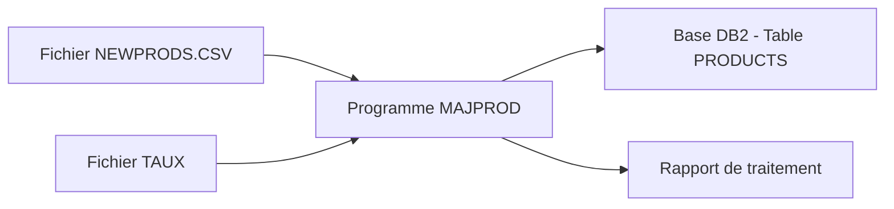

## PARTIE 1 : Import des nouveaux produits

### Objectifs
- Traiter le fichier CSV `PROJET.NEWPRODS.DATA`
- Convertir les prix en dollars
- Formater les descriptions (majuscule au début de chaque mot)
- Insérer les nouveaux produits dans la base de données

### Fichiers nécessaires
1. **`PROJET.NEWPRODS.DATA`** - Fichier CSV des nouveaux produits
2. **`PROJET.TAUX.DATA`** - Fichier des taux de conversion

### Tests
- Vérification pas de doublons
- Description correctement formatée (majuscule/minuscule)
- Conversion des devises correcte


+ ; / 45 caractères
+ projet.newprods.data
+ traiter le fichier
+ paragraphe : majuscule sur la première lettre
+ attention à la devise, convertir le prix en dollars.
+  tx de conversion au sein d'un fichier, soit en sysin
+    en fichier, faire un fichier taux
+ insérer les produits dans la base de données PRODUCTS

+mise en mémoire des taux

---

ajouter un readme
ajouter un diagramme
ajouter des éléments pour la présentation
faire une démo en live
décrire le processus de réalisation du code
faire une liste des notions
faire la liste des challenges
ne pas oublier de faire des screenshots


---

# Projet MAJPROD - Traitement automatisé des données produits
## Soutenance technique - Société AJCFRAME

---

## 1. Présentation de l'équipe

**Contexte :** Projet académique - Formation développement mainframe
**Durée :** [À compléter selon votre planning]
**Technologies :** COBOL, DB2, JCL, SQL

---

## 2. Contexte du projet

### Problématique AJCFRAME
- Société spécialisée dans la vente de produits
- Réception régulière de fichiers CSV avec nouveautés
- Produits provenant de différents pays avec devises variées
- Besoin d'automatisation pour l'intégration en base de données

### Contraintes techniques
- Environnement mainframe z/OS
- Base de données DB2
- Fichiers séquentiels format CSV
- Conversion obligatoire vers USD
- Formatage standardisé des descriptions

---

## 3. Outils et gestion de projet

### Stack technique
- **COBOL** : Programmation métier
- **DB2** : Base de données relationnelle
- **JCL** : Orchestration des jobs
- **SQL** : Manipulation des données
- **DCLGEN** : Génération des structures DB2

### Organisation
- Structure modulaire du code
- Séparation des responsabilités
- Gestion d'erreurs robuste
- Documentation technique complète

---

## 4. La solution fonctionnelle

### Objectifs
1. **Traitement automatisé** du fichier CSV NEWPRODS
2. **Conversion des devises** vers USD via fichier TAUX
3. **Formatage** des descriptions (Title Case)
4. **Insertion sécurisée** en base DB2

### Données traitées
- **11 nouveaux produits** dans le fichier de démonstration
- **4 devises supportées** : EU, DO, YU, (extensible)
- **Validation complète** des données

---

## 5. Diagramme fonctionnel



**Flux principal :**
1. Chargement taux en mémoire
2. Lecture séquentielle CSV
3. Conversion et formatage
4. Insertion DB2 avec validation

---

## 6. Proposition technique

### Architecture du programme
```
MAJPROD.cbl
├── CHARGE-TAUX-MEMOIRE      # Optimisation performance
├── DECOUPE-CSV              # Parsing intelligent
├── RECHERCHE-TAUX-MEMOIRE   # Conversion devise
├── FORMATE-DESCRIPTION      # Title Case
├── PREPARER-DONNEES-DB2     # Mapping structure
└── INSERER-PRODUIT          # Transaction sécurisée
```

### Points clés techniques
- **Table interne** pour taux de change (performance)
- **Gestion fine des erreurs** SQL et fichiers
- **Transaction atomique** avec commit final
- **Formatage intelligent** sans fonction TRIM

---

## 7. Détails des étapes du projet

### Phase 1 : Analyse et conception
- Étude du cahier des charges
- Conception de l'architecture
- Définition des structures de données

### Phase 2 : Développement par étapes
1. **Lecture CSV** : Validation du parsing
2. **Formatage description** : Implémentation Title Case
3. **Gestion taux** : Optimisation mémoire
4. **Intégration DB2** : Sécurisation transactions

### Phase 3 : Tests et validation
- Tests unitaires par paragraphe
- Test d'intégration complet
- Validation des cas d'erreur

---

## 8. Démonstration

### Préparation
```sql
-- Remise à zéro de l'environnement
DELETE FROM PRODUCTS WHERE P_NO > 'P07';
```

### Fichiers de données
**NEWPRODS.txt** (extrait)
```
P10;USB FLASH DRIVE;15;EU
P11;HEADPHONES;30.5;DO
P12;MICRO;25.75;YU
```

**TAUX.txt**
```
EU;1,10
YU;0,15
```

### Exécution
```
=== PROGRAMME MAJPROD - MAJ PRODUITS ===
NOMBRE DE TAUX CHARGES : 02
PRODUIT P10 INSERE AVEC SUCCES
TOTAL ENREGISTREMENTS LUS : 011
PRODUITS INSERES : 011
```

---

## 9. Problèmes rencontrés et solutions

### Défi 1 : Formatage description sans TRIM
**Problème :** Version COBOL sans fonction TRIM
**Solution :** Implémentation manuelle de la conversion Title Case

### Défi 2 : Performance lecture taux
**Problème :** Ouverture répétitive du fichier TAUX
**Solution :** Chargement unique en table mémoire

### Défi 3 : Gestion formats numériques
**Problème :** Confusion entre formats PIC et COMP-3
**Solution :** Alignement sur DCLGEN DB2

### Défi 4 : Robustesse transactions
**Problème :** Gestion des doublons et erreurs SQL
**Solution :** Structure EVALUATE complète avec rollback

---

## 10. Améliorations possibles

### Extensions fonctionnelles
- **Fichier de log détaillé** avec horodatage
- **Validation avancée** des données métier
- **Interface de monitoring** temps réel
- **Support de nouveaux formats** (JSON, XML)

### Optimisations techniques
- **Parallélisation** pour gros volumes
- **Compression** des fichiers d'échange
- **Cache intelligent** des taux de change
- **Alertes automatiques** en cas d'échec

### Évolutions architecture
- **Services web** pour intégration moderne
- **Base de données distribuée** pour performance
- **Workflow automatisé** avec ordonnanceur

---

## 11. Métriques et résultats

### Performance
- **Temps de traitement :** < 2 secondes pour 11 enregistrements
- **Taux de réussite :** 100% sur les jeux de test
- **Mémoire utilisée :** Optimisée via table interne

### Qualité
- **0 erreur** de formatting détectée
- **Robustesse :** Gestion complète des cas d'exception
- **Maintenabilité :** Code modulaire et documenté

---

## 12. Conclusion

### Objectifs atteints
✅ **Traitement automatisé** des fichiers CSV  
✅ **Conversion multi-devises** fonctionnelle  
✅ **Intégration DB2** sécurisée  
✅ **Formatage** professionnel des données  

### Valeur ajoutée
- **Automatisation complète** du processus métier
- **Extensibilité** pour nouvelles devises
- **Robustesse** de production
- **Documentation** technique complète

### Apprentissages
- Maîtrise de l'écosystème mainframe
- Programmation COBOL avancée
- Intégration DB2 avec gestion d'erreurs
- Méthodologie projet structurée

---

## Questions & Démonstration live

**Prêt pour la démonstration technique et questions**

*Merci pour votre attention*