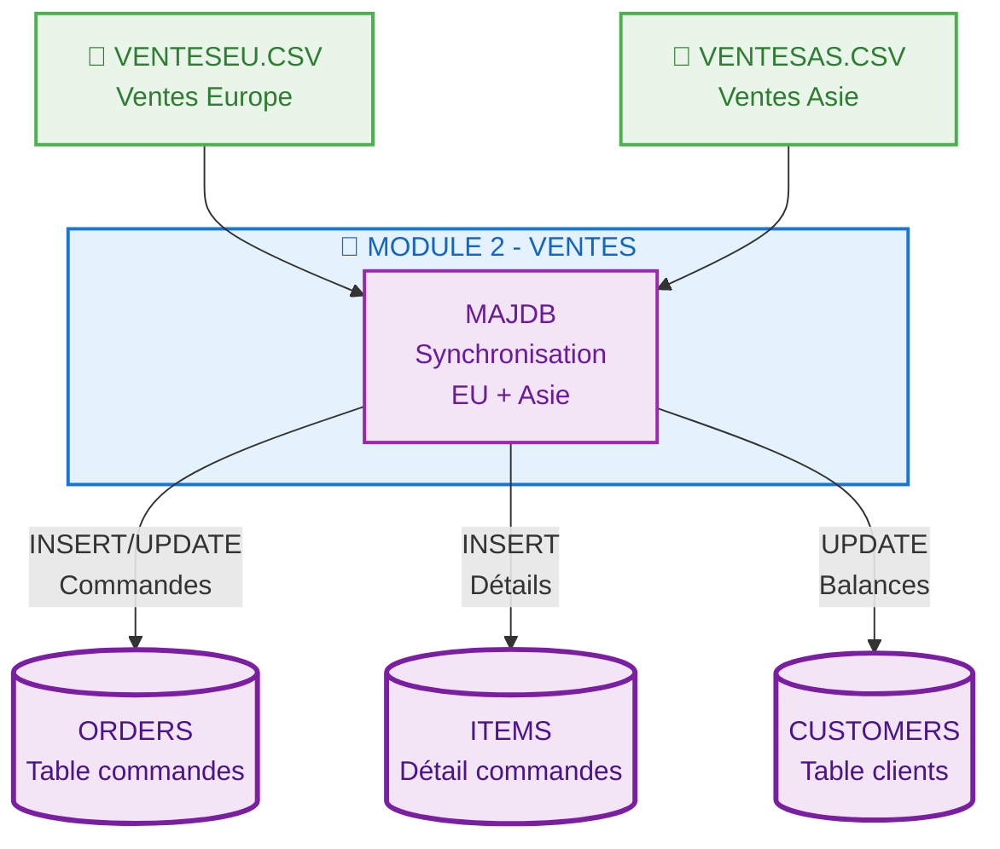

```mermaid
graph TB
    %% Définition des styles
    classDef moduleStyle fill:#e3f2fd,stroke:#1976d2,stroke-width:2px,color:#1565c0
    classDef dbStyle fill:#f3e5f5,stroke:#7b1fa2,stroke-width:3px,color:#4a148c
    classDef fileStyle fill:#e8f5e8,stroke:#4caf50,stroke-width:2px,color:#2e7d32
    classDef programStyle fill:#f3e5f5,stroke:#9c27b0,stroke-width:2px,color:#6a1b9a

    %% Fichiers d'entrée
    VENTESEU_CSV[📄 VENTESEU.CSV<br/>Ventes Europe]:::fileStyle
    VENTESAS_CSV[📄 VENTESAS.CSV<br/>Ventes Asie]:::fileStyle

    %% Module 2
    subgraph M2 ["🔧 MODULE 2 - VENTES"]
        MAJDB[MAJDB<br/>Synchronisation<br/>EU + Asie]:::programStyle
    end
    M2:::moduleStyle

    %% Base de données
    ORDERS[(ORDERS<br/>Table commandes)]:::dbStyle
    ITEMS[(ITEMS<br/>Détail commandes)]:::dbStyle
    CUSTOMERS[(CUSTOMERS<br/>Table clients)]:::dbStyle

    %% Flux
    VENTESEU_CSV --> MAJDB
    VENTESAS_CSV --> MAJDB

    MAJDB -->|INSERT/UPDATE<br/>Commandes| ORDERS
    MAJDB -->|INSERT<br/>Détails| ITEMS
    MAJDB -->|UPDATE<br/>Balances| CUSTOMERS
```