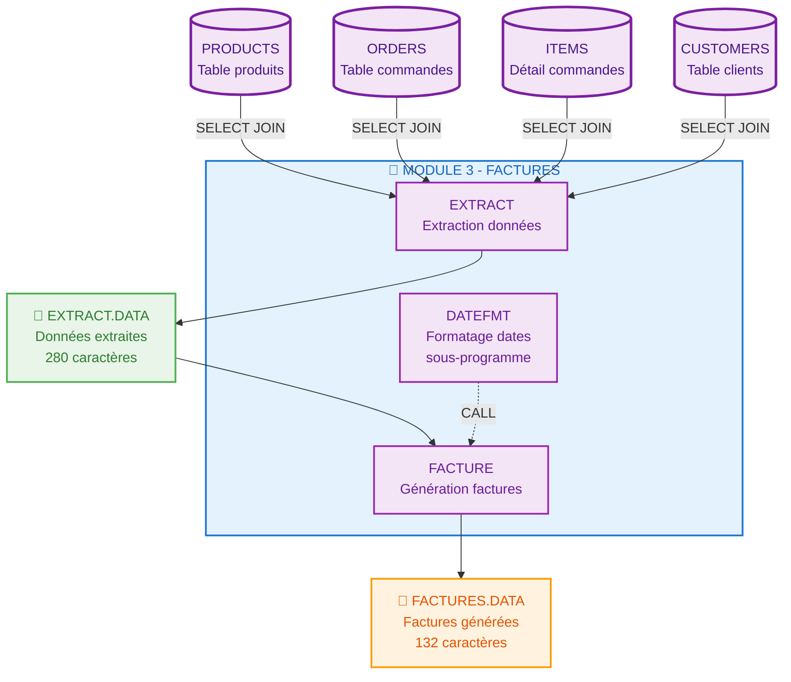

```mermaid
graph TB
    %% Définition des styles
    classDef moduleStyle fill:#e3f2fd,stroke:#1976d2,stroke-width:2px,color:#1565c0
    classDef dbStyle fill:#f3e5f5,stroke:#7b1fa2,stroke-width:3px,color:#4a148c
    classDef fileStyle fill:#e8f5e8,stroke:#4caf50,stroke-width:2px,color:#2e7d32
    classDef programStyle fill:#f3e5f5,stroke:#9c27b0,stroke-width:2px,color:#6a1b9a
    classDef outputStyle fill:#fff3e0,stroke:#ff9800,stroke-width:2px,color:#e65100

    %% Base de données (entrées)
    PRODUCTS[(PRODUCTS<br/>Table produits)]:::dbStyle
    ORDERS[(ORDERS<br/>Table commandes)]:::dbStyle
    ITEMS[(ITEMS<br/>Détail commandes)]:::dbStyle
    CUSTOMERS[(CUSTOMERS<br/>Table clients)]:::dbStyle

    %% Fichier intermédiaire
    EXTRACT_DATA[📄 EXTRACT.DATA<br/>Données extraites<br/>280 caractères]:::fileStyle

    %% Module 3
    subgraph M3 ["🔧 MODULE 3 - FACTURES"]
        EXTRACT[EXTRACT<br/>Extraction données]:::programStyle
        DATEFMT[DATEFMT<br/>Formatage dates<br/>sous-programme]:::programStyle
        FACTURE[FACTURE<br/>Génération factures]:::programStyle
    end
    M3:::moduleStyle

    %% Sortie finale
    FACTURES_DATA[📄 FACTURES.DATA<br/>Factures générées<br/>132 caractères]:::outputStyle

    %% Flux depuis DB2
    PRODUCTS -->|SELECT JOIN| EXTRACT
    ORDERS -->|SELECT JOIN| EXTRACT
    ITEMS -->|SELECT JOIN| EXTRACT
    CUSTOMERS -->|SELECT JOIN| EXTRACT

    %% Flux interne
    EXTRACT --> EXTRACT_DATA
    EXTRACT_DATA --> FACTURE
    DATEFMT -.->|CALL| FACTURE

    %% Sortie finale
    FACTURE --> FACTURES_DATA
```