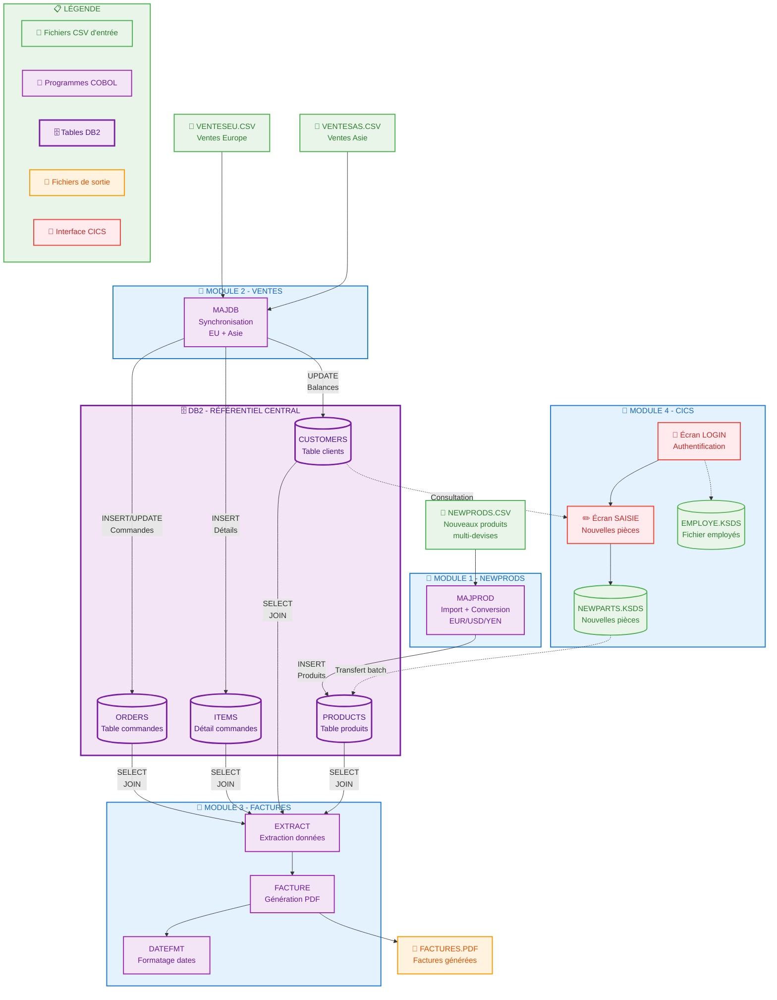

```mermaid
graph TB
    %% Définition des styles
    classDef moduleStyle fill:#e3f2fd,stroke:#1976d2,stroke-width:2px,color:#1565c0
    classDef dbStyle fill:#f3e5f5,stroke:#7b1fa2,stroke-width:3px,color:#4a148c
    classDef fileStyle fill:#e8f5e8,stroke:#4caf50,stroke-width:2px,color:#2e7d32
    classDef programStyle fill:#f3e5f5,stroke:#9c27b0,stroke-width:2px,color:#6a1b9a
    classDef outputStyle fill:#fff3e0,stroke:#ff9800,stroke-width:2px,color:#e65100
    classDef cicsStyle fill:#ffebee,stroke:#f44336,stroke-width:2px,color:#c62828

    %% Fichiers d'entrée
    NEWPRODS_CSV[📄 NEWPRODS.CSV<br/>Nouveaux produits<br/>multi-devises]:::fileStyle
    VENTESEU_CSV[📄 VENTESEU.CSV<br/>Ventes Europe]:::fileStyle
    VENTESAS_CSV[📄 VENTESAS.CSV<br/>Ventes Asie]:::fileStyle

    %% Module 1
    subgraph M1 ["🔧 MODULE 1 - NEWPRODS"]
        MAJPROD[MAJPROD<br/>Import + Conversion<br/>EUR/USD/YEN]:::programStyle
    end
    M1:::moduleStyle

    %% Module 2
    subgraph M2 ["🔧 MODULE 2 - VENTES"]
        MAJDB[MAJDB<br/>Synchronisation<br/>EU + Asie]:::programStyle
    end
    M2:::moduleStyle

    %% Module 3
    subgraph M3 ["🔧 MODULE 3 - FACTURES"]
        EXTRACT[EXTRACT<br/>Extraction données]:::programStyle
        FACTURE[FACTURE<br/>Génération PDF]:::programStyle
        DATEFMT[DATEFMT<br/>Formatage dates]:::programStyle
        EXTRACT --> FACTURE
        FACTURE --> DATEFMT
    end
    M3:::moduleStyle

    %% Module 4
    subgraph M4 ["🔧 MODULE 4 - CICS"]
        LOGIN[🔐 Écran LOGIN<br/>Authentification]:::cicsStyle
        SAISIE[✏️ Écran SAISIE<br/>Nouvelles pièces]:::cicsStyle
        EMPLOYE_KSDS[(EMPLOYE.KSDS<br/>Fichier employés)]:::fileStyle
        NEWPARTS_KSDS[(NEWPARTS.KSDS<br/>Nouvelles pièces)]:::fileStyle
        
        LOGIN --> SAISIE
        LOGIN -.-> EMPLOYE_KSDS
        SAISIE --> NEWPARTS_KSDS
    end
    M4:::moduleStyle

    %% Base de données centrale
    subgraph DB2 ["🗄️ DB2 - RÉFÉRENTIEL CENTRAL"]
        PRODUCTS[(PRODUCTS<br/>Table produits)]:::dbStyle
        ORDERS[(ORDERS<br/>Table commandes)]:::dbStyle
        ITEMS[(ITEMS<br/>Détail commandes)]:::dbStyle
        CUSTOMERS[(CUSTOMERS<br/>Table clients)]:::dbStyle
    end
    DB2:::dbStyle

    %% Sorties
    FACTURES_PDF[📄 FACTURES.PDF<br/>Factures générées]:::outputStyle

    %% Flux principaux
    NEWPRODS_CSV --> MAJPROD
    VENTESEU_CSV --> MAJDB
    VENTESAS_CSV --> MAJDB

    %% Vers DB2
    MAJPROD -->|INSERT<br/>Produits| PRODUCTS
    MAJDB -->|INSERT/UPDATE<br/>Commandes| ORDERS
    MAJDB -->|INSERT<br/>Détails| ITEMS
    MAJDB -->|UPDATE<br/>Balances| CUSTOMERS

    %% Depuis DB2
    PRODUCTS -->|SELECT<br/>JOIN| EXTRACT
    ORDERS -->|SELECT<br/>JOIN| EXTRACT
    ITEMS -->|SELECT<br/>JOIN| EXTRACT
    CUSTOMERS -->|SELECT<br/>JOIN| EXTRACT

    %% Sorties finales
    FACTURE --> FACTURES_PDF

    %% Interface CICS bidirectionnelle
    NEWPARTS_KSDS -.->|Transfert batch| PRODUCTS
    CUSTOMERS -.->|Consultation| SAISIE

    %% Légende avec notes
    subgraph LEGEND ["📋 LÉGENDE"]
        L1[📄 Fichiers CSV d'entrée]:::fileStyle
        L2[🔧 Programmes COBOL]:::programStyle
        L3[🗄️ Tables DB2]:::dbStyle
        L4[📄 Fichiers de sortie]:::outputStyle
        L5[🔐 Interface CICS]:::cicsStyle
    end
    LEGEND:::fileStyle
```
